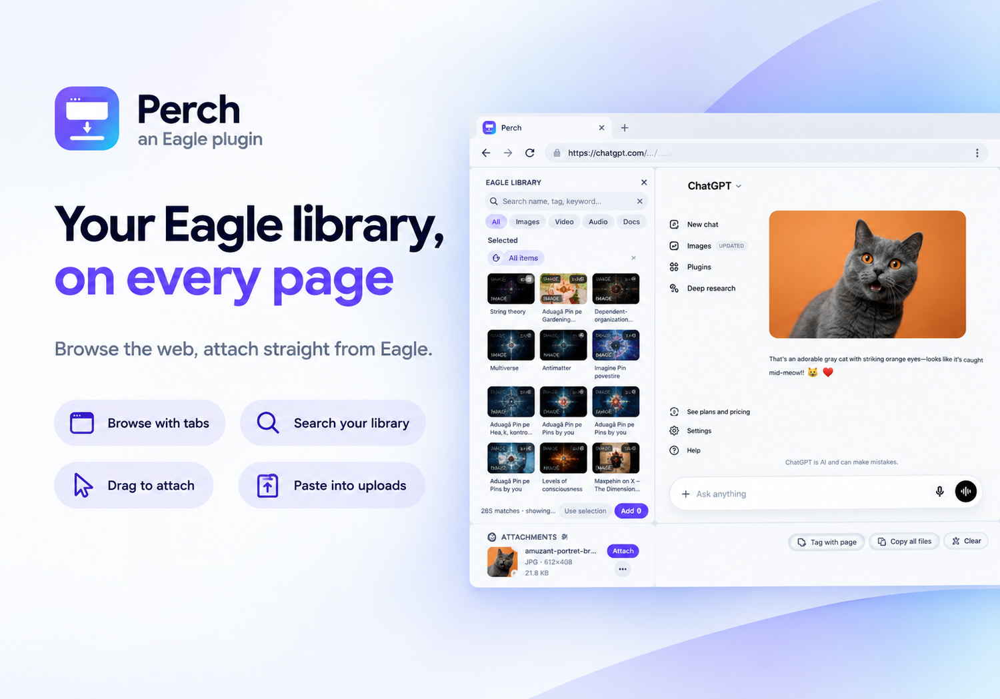
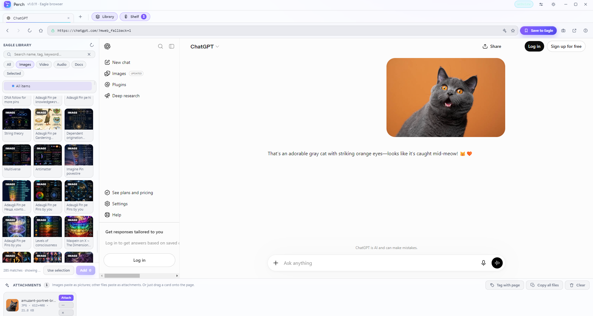
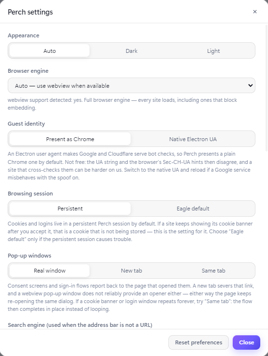

# Perch

An Eagle plugin that puts a web browser next to your asset library — so you can find a file and attach it to the page you are on without leaving Eagle.



---

## Features

**Browse.** Tabs, an address bar that takes a URL *or* a search query, back/forward, reload
(`Shift` for a hard reload), a start page with quick links and recent pages, per-tab history,
favicons and a loading indicator. `window.open` pop-ups are handled (configurable, because
sign-in flows depend on them).

**Pick from your Eagle library.** A side panel with a folder tree, kind filters (images, video,
audio, docs), search, and a thumbnail grid. **Use selection** takes whatever is currently selected
in Eagle itself. A 100k-item library stays responsive: the unfiltered view pages through Eagle's
fast listing API and only fetches full records for the slice on screen.

**Attach it to the page.** An attachment shelf that survives restarts. Four routes, in order of
what usually works:

| Route | What it does | Good for |
|---|---|---|
| **Drag** | Drag a card onto the page as a real OS drag (`eagle.drag.startDrag`) | Any drop zone or file field |
| **Attach** | A single image goes on the clipboard as fitted **image data**; anything else as the real **file** (`clipboard.copyFiles`). Paste with Ctrl/⌘+V | AI chats, editors, compose windows, upload fields |
| **Copy image** | Right-click → *original size* or *fitted* | When fidelity or size matters specifically |
| **Copy path / name** | Plain text | File pickers, scripts, terminals |

Attaching is honest about size: an image already within limits is handed over **byte-for-byte**,
and only oversized ones are fitted (to 1600px on the long edge, JPEG staying JPEG, PNG→JPEG only
when there is no transparency to destroy). Design sources (`psd`, `ai`, `sketch`, `fig`) and
`heic`/`tiff` are sent down the file route, because a browser cannot decode them into pixels.

**Work back into Eagle.**

- **Save to Eagle** — the current page becomes a bookmark with a screenshot of the page as its thumbnail.
- **Capture** — screenshots the current view straight into your library.
- **Tag with page** — adds the current domain as a tag to every item on the shelf.
- Right-click any card for a native menu: reveal in file manager, open the file, open in Eagle.

**Diagnostics that answer questions.** *Run attachment self-test* writes an image the way an attach
does and reads it back off the clipboard. *Probe this page* reports whether the loaded page can
store a cookie. *Copy diagnostics* produces a report — version, engine, session mode, what the
last attach wrote, the page's own console errors and a log tail.

---

## Requirements

- **Eagle 4.0 or later** (developed and tested against 4.0.0, build 23) on Windows or macOS.
- **Network access** to load the pages you browse. Perch itself needs no account, key or subscription.
- **No build step and no dependencies** — plain HTML/CSS/JS. Node.js is only needed to run the
  development checks in `tools/`.
- **Rendering depends on Eagle.** Eagle plugin windows are Electron windows, and whether a plugin
  may use the `<webview>` engine is a flag in Eagle that a plugin cannot set. When it is available,
  Perch is a full browser. When it is not, Perch renders pages in a frame, and sites that forbid
  being embedded (Google, banks, Cloudflare-protected pages) cannot be displayed — Perch detects
  this and offers to open them in your system browser. See [Troubleshooting](#troubleshooting).

---

## Installation

1. **Get the plugin** — clone the repository, or download and unzip it:

   ```bash
   git clone https://github.com/Stef4678/perch.git
   ```

2. **Put it somewhere permanent**, e.g. `Documents/Eagle plugins/perch`. Eagle loads the plugin
   from this path, so don't leave it in a temp folder or inside your Downloads.

   If you only want the built plugin rather than the source, use
   **`dist/perch-<version>.eagleplugin`** — open or import that file from Eagle's plugin panel
   (see [Packaging](#packaging)).

3. **Add it to Eagle** — open Eagle, click the **Plugin** button in the toolbar, then
   **Developer Options** and import/create a plugin pointed at this folder. Alternatively use
   **Pack Plugin** to produce a `.eagleplugin` file and open that.

4. **Open Perch** from the plugin list. The window opens on the start page.

Notes:

- **The plugin `id` is a UUID and must stay fixed.** Eagle rejects any other format, and changing
  it after release makes the plugin a different plugin to Eagle — existing installs would not see
  updates. `tools/check.mjs` enforces the format; never edit it casually.
- Set `"devTools": true` in `manifest.json` for a Chromium devtools window while developing. It
  ships as `false`.
- **Preview without Eagle:** open `index.html` in any Chromium browser. The Eagle bridge falls back
  to generated demo data, so the whole UI works minus the Eagle-only calls.
- The title bar shows the running version — the quickest way to confirm a reload picked up new code.

---

## Usage

```
┌──────────────────────────────────────────────────────────────────────┐
│ ◉◉◉  Perch · Eagle browser              webview   ⚙  ☾   ─  ▢  ✕     │
├──────────────────────────────────────────────────────────────────────┤
│ ▸ Gmail  ▸ Notion          ＋   │ Library │ Shelf ③                  │
├──────────────────────────────────────────────────────────────────────┤
│ ← → ⟳ ⌂ │ 🔒 https://example.com/…      │ ★ │ Save to Eagle  📷  ↗  │
├───────────────────────┬──────────────────────────────────────────────┤
│ EAGLE LIBRARY         │                                              │
│ [search…]             │              the web page                    │
│ All Images Video Docs │                                              │
│ ▾ Design              │                                              │
│ ▦ ▦ ▦ ▦ ▦ ▦           │                                              │
│ 1,204 matches · 60    │                                              │
│ [Use selection] [Add] │                                              │
├───────────────────────┴──────────────────────────────────────────────┤
│ ATTACHMENTS ③   Images paste as pictures; other files as files.      │
│ [▦ hero.jpg  Attach ⋯ ×] [▦ brief.pdf  Attach ⋯ ×]                  │
└──────────────────────────────────────────────────────────────────────┘
```

**The workflow**

1. Open a page in the right-hand pane — type an address or a search into the bar at the top.
2. Find a file on the left. Click **+** on a card to shelve it, or press **Use selection** to take
   whatever is selected in Eagle right now.
3. Attach it from the shelf: **drag** the card onto the page, or press **Attach** and paste with
   Ctrl/⌘+V.

**Sign in first.** This is the step that catches everyone. A signed-out web app (Gemini, ChatGPT,
Drive) still shows its drop zone and then silently discards what you attach, because the upload is
an authenticated request. Nothing errors, nothing appears. Sign in inside the Perch window first —
Perch keeps its own persistent session for that.

**Screenshots**





**Keyboard**

| Keys | Action |
|---|---|
| `Ctrl/⌘ T` / `Ctrl/⌘ W` | New tab / close tab |
| `Ctrl/⌘ L`, `Ctrl/⌘ K` | Focus the address bar |
| `Ctrl/⌘ R`, `F5` | Reload (`Shift` for a hard reload) |
| `Ctrl/⌘ Shift O` | Open the current page in your normal browser |
| `Ctrl/⌘ Tab` | Next tab · `Ctrl/⌘ 1…9` jump to tab |
| `Alt ←` / `Alt →` | Back / forward |
| `Ctrl/⌘ B` | Toggle the Eagle library panel |
| `Ctrl/⌘ Shift A` | Toggle the attachment shelf |
| `Ctrl/⌘ ,` | Settings |
| `Ctrl/⌘ /`, `F1` | Shortcuts and tips |
| `Esc` | Close menus and dialogs, or stop loading |

**Settings**

- **Appearance** — auto (follows Eagle), dark, light.
- **Browser engine** — auto, or force webview/iframe.
- **Guest identity** — present the page as Chrome (default) or leave the native Electron user agent.
- **Browsing session** — a persistent Perch session (default) or Eagle's default session.
- **Pop-up windows** — real window (default), new tab, or same tab.
- **Search engine** and **home page**.
- **Maintenance** — self-test, probe, copy diagnostics, rebuild tab views, reload, reset.

---

## Troubleshooting

**Start here.** *Settings → Copy diagnostics* produces a report with the plugin version, the engine
(`requested → granted`), session and pop-up modes, what the last attach actually wrote, the current
page's own console errors, and a log tail. *Settings → Run attachment self-test* proves the
clipboard half works on your machine. Nine times out of ten the report says what is wrong.

### Many sites will not load

Check the engine pill in the title bar. `iframe · limited` means Eagle does not expose the
`<webview>` engine to plugins, so Perch renders pages in a frame and sites that forbid embedding
(Google, Gemini, GitHub, most banks) cannot be displayed. That is a host limitation, not a setting —
no Eagle plugin can show those pages in a frame. Use the **Open in browser** button (`Ctrl/⌘ ⇧ O`)
for them. Perch does keep looking for the webview engine for a few seconds after start-up and
upgrades itself if it appears.

### The page pane is blank, or stops drawing after switching tabs

The engine element is wedged, not lost. Press **Rebuild view** on the failure card, or
*Settings → Rebuild tab views*: Perch discards the tab's rendering surface, builds a fresh one and
reloads the same URL.

### "Content was not generated" (Gemini / Google AI)

That is Gemini failing to *generate*, not failing to upload — the attachment was accepted and the
model request failed. In `iframe · limited` mode the cause is settled: Google services need a
first-party signed-in session, which a framed page cannot have. Use your normal browser for the AI
and Perch for the Eagle side (Attach → paste), or press Open-in-browser. On the webview engine,
run **Copy diagnostics** after an attempt: if `lastAttach` shows `image (fitted) · 1600×1200`, the
bytes left Perch correctly and the failure is upstream.

### A consent banner repeats forever ("accept cookies" → asked again)

First check the engine pill — a framed site is a third party, Chromium refuses its cookies, and
Accept can never stick; that is below Perch. On the webview engine, *Settings → Probe this page*
writes one throwaway cookie and reads it back:

| Result | Meaning |
|---|---|
| `canWriteCookie: false` | Storage is denied for that page, so Accept can never stick. |
| `canWriteCookie: true` | Storage works, so the loop is the site's own pop-up/consent logic — set *Pop-up windows → Same tab*. |

Pop-ups default to **real windows** because consent screens report back to the page that opened
them, and a new tab severs that link.

### Nothing happens when I drag a card onto the page

1. **Sign in to the site** — see Usage above; signed-out apps accept the drop and discard it.
2. Perch reports which way the drop went: `dropEffect: none` means the page refused it, and Perch
   then copies the files to your clipboard and says so. An accepted drop reports **"Delivered to
   the page"** — if nothing appears after that, the site ignored it.
3. **Use Attach instead** — it works on sites that ignore drops entirely.

### "Please wait a moment" / "Verify you are human" — and it never goes away

That is a Cloudflare challenge, and it cannot be passed in an embedded browser: Cloudflare
fingerprints the browser, and a plugin cannot make the user-agent string and the `Sec-CH-UA` client
hints agree. Perch detects the challenge page and says so, with the Open-in-browser button to hand
it to a real browser. Worth one try: *Settings → Guest identity → Native Electron UA*.

### A site rejects the attachment

1. **Drag the card** — a native drop is a different code path in the site's uploader.
2. **The image is too big** — Attach already fits images to 1600px; if it still refuses, the limit
   is the site's own.
3. **Unsupported format** — `psd`, `ai`, `fig`, `heic` and `svg` live happily in Eagle and are often
   rejected by web forms. Export to PNG/JPEG first.

---

## Privacy & data

No telemetry, no analytics, no remote code, no third-party requests. Perch talks to exactly two
things: the Eagle APIs in-process, and the websites you navigate to.

- **Your library stays local.** Nothing about it leaves your machine except the files you
  deliberately attach to a page — at which point that page receives them, exactly as in any browser.
- **Clipboard, drag, file reveal/open and screenshots are local operations**, triggered by you.
  Attach writes to the system clipboard so you can paste into any application, including another
  browser window.
- **What it writes to your library:** *Save to Eagle* and *Capture* add new items. *Tag with page*
  adds a tag to items you choose. Perch does not delete, move or overwrite anything.
- **Sessions.** Preferences, shelf contents, quick links and open tabs are kept in `localStorage`.
  Web cookies and logins live in Perch's own persistent browsing session (`persist:perch`), separate
  from Eagle's — so you sign in to a site once inside Perch and it stays.
- **The user agent is rewritten** for the web view, to stop embedded-browser bot challenges: the
  Electron and app tokens are stripped so the guest presents a plain Chrome user agent. It is
  disclosed here and shown in Settings; it can be switched off, and *Settings → Copy diagnostics*
  prints the exact string. It is the only thing Perch changes about what sites see.

---

## Project structure

```
manifest.json          Eagle plugin manifest (frameless window, 1320×880)
index.html             the entire UI shell
logo.png               256×256 plugin icon
LICENSE                MIT
css/app.css            design tokens, dark + light themes, all components
js/util.js             DOM helpers, inline SVG icon set, toasts, modals, URL normalising
js/eagle-bridge.js     every eagle.* call, guarded — plus demo data outside Eagle
js/engine.js           webview / iframe adapters behind one interface
js/library.js          Eagle picker: folders, filters, search, paged thumbnail grid
js/shelf.js            the attachment shelf + P.actions (drag, copy, reveal, tag, self-test)
js/browser.js          tabs, omnibox, per-tab history, start page, Eagle round-trips
js/app.js              bootstrap, theme, window controls, shortcuts, settings, diagnostics
assets/                cover art and interface screenshots — not shipped
dist/                  the built package: perch-<version>.eagleplugin (committed)
tools/make-dist.mjs    builds dist/ from the source tree
tools/package-files.mjs  what belongs in a package, defined once
tools/zip.mjs          dependency-free ZIP reader/writer used for packaging
tools/make-logo.mjs    regenerates logo.png (geometry + zlib, no image libraries)
tools/check.mjs        static checks: element ids, assets, manifest, CSS invariants, package
tools/smoke.mjs        boots the real code against a DOM shim and drives the main flows
```

No build step, no bundler, no runtime dependencies. Load order matters: `util → eagle-bridge →
engine → library → shelf → browser → app`.

**Development checks**

```bash
node tools/make-dist.mjs   # rebuild dist/ after any source change (check.mjs fails if it drifts)
node tools/check.mjs       # ids referenced by JS exist in the DOM, assets present, manifest
                           # complete, shell grid pinned, button labels not squashable,
                           # dist/ byte-identical to source, helpers behave
node tools/smoke.mjs       # ~160 assertions: boots the app against a DOM shim and drives library
                           # paging, shelving, tabs, engine switching, attach routes, self-test,
                           # diagnostics and the failure paths
```

`tools/smoke.mjs` is deliberately honest about its limits: it cannot test real `<webview>`
rendering, the Eagle APIs, native drag, the OS clipboard or `capturePage`.

**Packaging**

`dist/perch-<version>.eagleplugin` is the installable package: a ZIP with `manifest.json` at its
root, holding the runtime files plus the licence and readme, and nothing else.

```bash
node tools/make-dist.mjs   # rebuild dist/perch-<version>.eagleplugin
```

It is committed on purpose, and `tools/check.mjs` opens it on every run. The check fails if the
package drifts from the source, loses a module, reports the wrong version, or gains a file that
must not ship — development tooling, marketing assets, nested archives or credentials, all of
which Eagle's package criteria reject. A stale package cannot slip through.

Eagle's own **Pack Plugin** builds the same container from the loaded plugin folder and is the
authoritative way to produce one; if you change `id` in `manifest.json`, prefer it over this
script. The archive is also attached to each GitHub release.

---

## Contact

Questions, bug reports and feature requests are welcome:

- **GitHub:** [Stef4678/perch](https://github.com/Stef4678/perch)
- **Email:** stefaninfp@gmail.com

When reporting a problem, *Settings → Copy diagnostics* output saves a round trip — it includes the
version, engine, what the last attach wrote and the page's own console errors.

---

## License

Released under the MIT License.

MIT © 2026 Kerekes Stefan — see [LICENSE](LICENSE).
